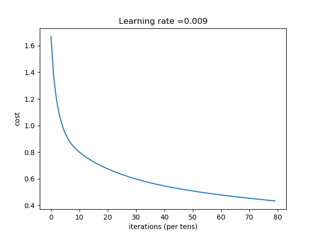
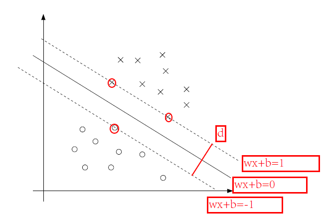
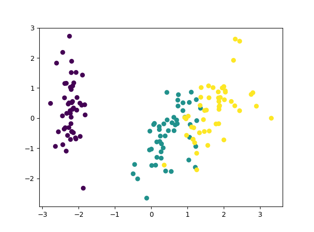
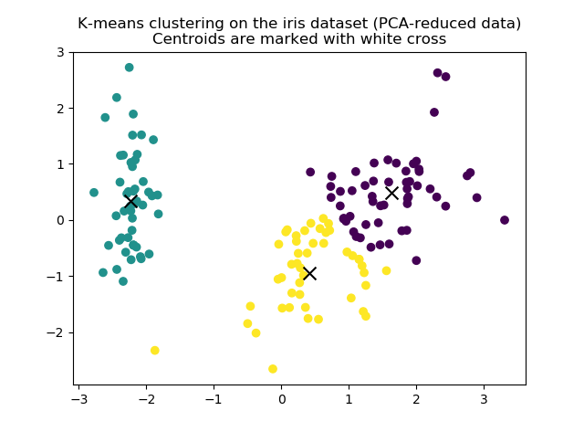
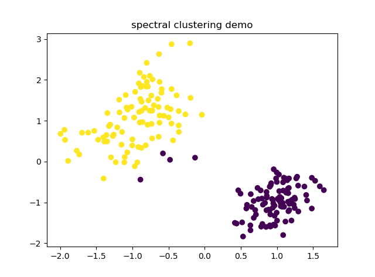
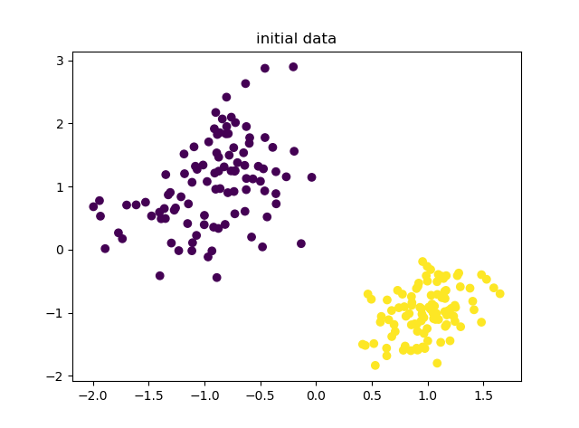
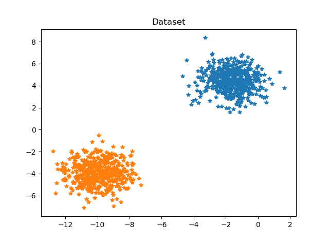
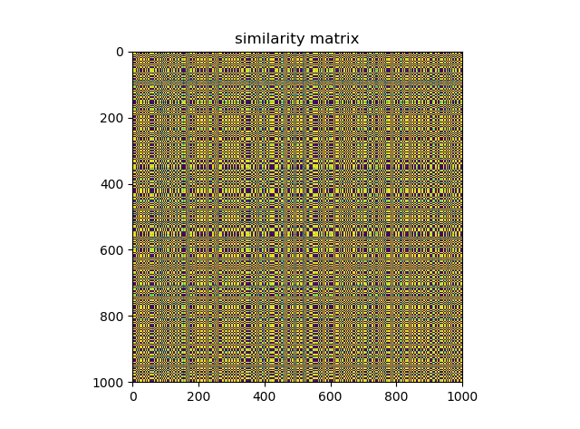
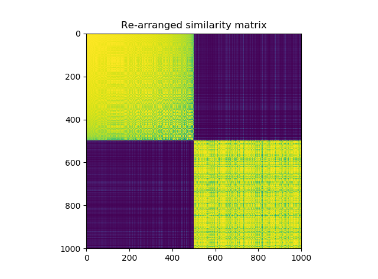
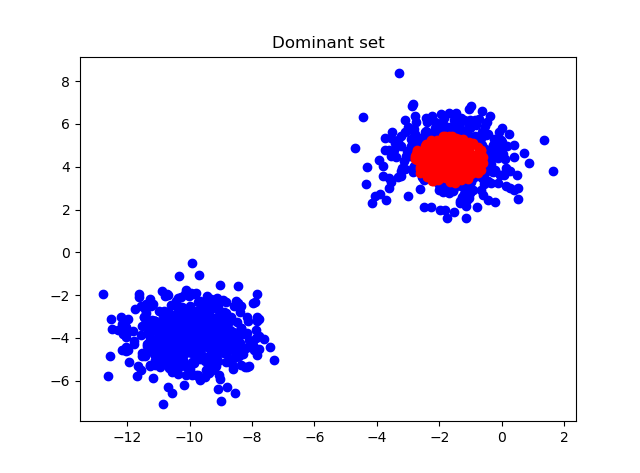

Machine learning course report

===
# 1. Neural network models
## 1.1 Multi-layer Perceptron
&emsp;&emsp;Multi-layer Perceptron (MLP) is a supervised learning algorithm that learns a function $f(\cdot): R^m \rightarrow R^o$ by training on a dataset, where m is the number of dimensions for input and o is the number of dimensions for output. Given a set of features $X = {x_1, x_2, ..., x_m}$ and a target y, it can learn a non-linear function approximator for either classification or regression. It is different from logistic regression, in that between the input and the output layer, there can be one or more non-linear layers, called hidden layers.The follow figure show a one hidden layer MLP with scalar output.

&emsp;&emsp;the advantages of multi-layer perceptron are:

* capability to learn non-linear models
* capability to learn models in real time\(on line learning\) using partial fit method

&emsp;&emsp;the disadvantages of multi-layers perceptron are:
* MLP with hidden layers have a non-convex loss function where there exists more than one local minimum. Therefor different random initializations can lead to different validation accuracy.
* MLP requires turning numbers of hyperparameters such as number of hodden layers, nuerals in each layer, iterations and regulation item.
* MLP is sensitive to feature scaling.

## 1.2 Classification
&emsp;&emsp;Class MLPClassification impements a multi-layer perception algorithm that trains by using backpropagation methods. The following picture show the basic data flow in training a MLP models. A L-layers models must have at least one non-linear layer to learn a non-linear model. Generally, there are L-1 linear layers with Relu activation function, and the last layer is sigmoid non-linear activation function. One important note: sigmoid is a saturated function, during the backpropagation process, it tend to happen gradient vanishing which can lead to unwilling early-stop. But in the output layer, we use softmax function and cross-entry loss function, the log will cancel out the influence of sigmoid, so we can also have a fair result.

&emsp;&emsp;We use iris dataset from [UCI](http://archive.ics.uci.edu/ml/datasets/Iris). This dataset is very simple, it has only 4 attributes: 

1. sepal length in cm 
2. sepal width in cm 
3. petal length in cm 
4. petal width in cm  
and 3 class:
* -- Iris Setosa 
* -- Iris Versicolour 
* -- Iris Virginica  

predicted accuracy in train data: 
Accuracy: 0.925 
predicted accuracy in test data: 
Accuracy: 0.9642857142857143 

---
# 2. Support Vector Machine
## 2.1 The Derivation of binary linear SVM
&emsp;&emsp;SVMs may be the best "off-the-shelf" surpervised learning algorithm before the well-known deep-learning. To tell the story of SVM, we will first introduce the margins, including function margins and geometric margins. Then we go into optimal margins classifier, which will lead us into a digression on lagrange duality. By solving the dual problem, we can easily extend SVMs to high dimensional feature spaces, then we can apply SVMs in non-linear problem efficiently.
### 2.1.1 Geometric Margin
&emsp;&emsp;We assume the hypeplane that can seperate the data is defined with W*X+b=0
, then the distance between point(xi,yi) and the hypeplane is $yi*(W^{T}*X+b) / ||W||$. From the intuition, we want to find the maximum margin hypeplane to seperate data, like the below figure. it's obviously that if we want to max the margin, we need max the distance d, which is related to $1/||W||$(it's easily to know), so we can obtain below optimal problem:

$$min_{\gamma,\omega,b} = \frac 12 * {\Vert\omega\Vert}$$
$$s.t.\quad y^{(i)}(\omega^{(T)}X^{(i)}+b)\geq1, \quad i=1,\ldots,m$$

&emsp;&emsp;We have transformed the problem into a form that can be efficiently solved. The above is an optimization problem with a convex quadratic objective and only linear constraints. It's solution gives us optimal margin classifier. While we could solve the problem in this form, but we won't do that. we will introduce kernel trick by transform that problem to a dual form. It's two advantages to do that:

* play a key role in allowing us to use kernels to get optimal margin classiers to work efficiently in very high dimensional spaces.
* The dual form will also allow us to derive an efficient algorithm for solving the above optimization problem that will typically do much better than primal problem.

### 2.1.2 Lagrange duality
&emsp;&emsp;Consider the following, which we'll call the primal optimation problem:

$$min_\omega \quad f(\omega)$$

$$s.t.\quad g_{i}(\omega)\leq0, \quad i=1,\ldots,k$$

$$\quad  h_i(\omega)=0,\quad i=1,\ldots,l$$

&emsp;&emsp;To solve it, we start by dening the generalized Lagrangian

$$\Gamma(\omega,\alpha,\beta) = f(\omega)+\sum_{i=1}^k{\alpha_ig_i(\omega)+\sum_{i=1}^l}\beta_ih_i(\omega)$$

&emsp;&emsp;Consider the quantity

$$\theta_p(\omega)=max_{\alpha,\beta:\alpha_i\geq0}\quad \Gamma(\omega,\alpha,\beta)$$

&emsp;&emsp;Let some $\omega$ be given. If $\omega$ violates any of the primal constraints: $g_i(\omega)>0\quad orh_i(\omega)\neq0$ the above formula should be able to verify that

$$\theta_p(\omega)=max_{\alpha,\beta:\alpha_i\geq0} \quad f(\omega)+\sum_{i=1}^k{\alpha_ig_i(\omega)+\sum_{i=1}^l}\beta_ih_i(\omega)=\infty$$

&emsp;&emsp;Conversely, if the constraints are indeed satised for a particular value of $\omega$, then $\theta_p(\omega)=f(\omega)$. Hence:

$$ f(x)=\left\{
    \begin{aligned}
    \theta_p(\omega)  & =  f(\omega) \quad ,{if \quad \omega \quad satisfies \quad priaml \quad constraints}  \\
    \theta_p(\omega)  & =  \infty \quad ,otherwise\\
    \end{aligned}
    \right.
$$

&emsp;&emsp;Thus, $\theta_p$ takes the same value as the objective in our problem for all values of $\omega$ that satisfies the primal constraints, and is positive infinity if the constraints are violated. Hence, if we consider the minimization problem:

$$min_\omega\theta_p(\omega)=min_\omega \quad max_{\alpha,\beta:\alpha_i\geq0}\Gamma(\omega,\alpha,\beta)$$

We see it's the same problem of our original primal problem. Now, we look at a slightly different problem. We difine:

$$\theta_D(\alpha,\beta)=min_\omega \Gamma(\omega,\alpha,\beta)$$
Now, we can see dual problem:

$$max_{\alpha,\beta:\alpha_i\geq0}\theta_D(\alpha,\beta)=max_{\alpha,\beta:\alpha_i\geq0}min_\omega\Gamma(\omega,\alpha,\beta)$$

With KKT conditions, the primal problem and dual problem have same result, so we can solve primal problem by solve dual problem, in this way, we can get many advantages.

### 2.1.3 Optimal Margin Classifier
&emsp;&emsp;So far, we have achieved nearly half of the works. Previously, we have obtained the following primal optiminization problem for finding optimal margin classifier:

$$min_{\gamma,\omega,b} = \frac 12 * {\Vert\omega\Vert}$$

$$s.t.\quad y^{(i)}(\omega^{(T)}x^{(i)}+b)\geq1, \quad i=1,\ldots,m$$

As the last section have indicated, we can transformed above primal problem into dual problem:

$$max_{\alpha:\alpha_i\geq0}\theta_d(\alpha)=max_{\alpha:\alpha_i\geq0}min_{\omega,\beta}\Gamma(\omega,b,\alpha)$$

We first derivate $\Gamma$ with $\omega$ and let it equal to zero, we get:

$$\nabla_\omega \Gamma(\omega,b,\alpha)=\omega-\sum_{i=1}^m\alpha_iy^{(i)}x^{(i)}=0$$

Then, as for derivative with respect to b, we get:

$$\nabla_b \Gamma(\omega,b,\alpha)=\sum_{i=1}^m\alpha_iy^{(i)}=0$$

Plug them back to lagrangian equation and simplify, we get the following dual optiminization problem:

$$max_\alpha \quad W(\alpha)=\sum_{i=1}^m\alpha_i-\frac 12 \sum_{i,j=1}^my^{(i)}y{(j)}\alpha_i\alpha_j \langle x^{(i)},x^{(j)} \rangle$$

$$s.t. \quad \alpha \geq0, \quad i=1,\ldots,m$$

$$\sum_{i=1}^m\alpha_iy^{(i)}=0$$

&emsp;&emsp;Now, our aim is to solve above dual problem, next section we use SMO algorithm to solve it.

## 2.2 The SMO Algorithm
&emsp;&emsp;Here is the dual problem with L1 regulation:

$$max_\alpha \quad W(\alpha)=\sum_{i=1}^m\alpha_i-\frac 12 \sum_{i,j=1}^my^{(i)}y{(j)}\alpha_i\alpha_j \langle x^{(i)},x^{(j)} \rangle$$

$$s.t. \quad 0\leq\alpha\leq C, \quad i=1,\ldots,m$$

$$\sum_{i=1}^m\alpha_iy^{(i)}=0$$

&emsp;&emsp;Now,suppose we want to hold $\alpha_3,\ldots,\alpha_m$ fixed, and take a coordinate ascent step and reoptimize the objective with respect to $\alpha_1,\alpha_2$. if we want to update some subject of the $\alpha_i$'s, we must update at
least two of them simultaneously in order to keep satisfying the constraints.
This motivates the SMO algorithm, which simply does the following:

Repeat till convergence {
1. Select some pair $\alpha_i$ and $alpha_j$ to update next (using a heuristic that
tries to pick the two that will allow us to make the biggest progress
towards the global maximum).
1. Reoptimize W($\alpha$) with respect to $alpha_i$ and $\alpha_j$ , while holding all the
other $\alpha_k$'s (k $\neq$ i; j) fixed. 
}

## 2.3 Realize linear binary SVM classifier in Python

---
# 3. K-means Cluster
## 3.1 Description of K-means Algorithms
&emsp;&emsp;The K-means clustering algorithm is as follows:

1. Initialize cluter centroids $\mu_1,\ldots,\mu_k$ randomly.
2. Repeat until convergence:{ 
for every i, set $c^{(i)}=argmin_j{||x^{(i)}-\mu_j||}^2$.  
for each j, set $\mu_{j}=\sum_{i=1}^m1\{c^{(i)=j}\}x^{(i)}/\sum_{i=1}^m1\{c^{(i)=j}\}$. 
}

&emsp;&emsp;In the above algorithm, the K is number of clusters which we want to find;and the cluster centroids represent our current guesses for the position of the centers of clusters. To initialize the cluster centroids, we could choose k training examples randomly, and set the cluster centroids to be equal to the values of these k examples. There are two serious problem with that initialization method:

1. Need specify the K of cluster numbers, which is very hard to estimate just from intuitiion
2. The result is influenced by initial centroids intensively. (the k-means++ can solve this problem)

Anyway, there are other initialization methods, such k-means++ and k-means-||. The inner loop of the algorithm repeatedly carries out two steps:

* Assign each trainning example $x^{(i)}$ to the closest cluster centroid $\mu_j$.
* Move each cluster centroid $\mu_j$ to the mean of the points and assign to it.

&emsp;&emsp;The k-means++ initialization method can solve the second problem. The basic princeple of selecting initial cluster centroids is that the distances between initial centroids should be long as far as possible. The steps of initialization cluster centroids is follows: 

1. Selecting a training example randomly as a first cluster centroid.
2. Respect to each sample X in training data, calculat the distance with latest cluster centroid which has been computed before, then seleting a new cluster centroid according to below probability:
    *  calculate distances between each data point and with respect to its latest cluster centroid, we can obtain a distance set $D(1),\ldots,D(n)$, calculat the sum of distance $D=\sum_{i=1}^nD(i)$.
    *  Select a random value $r$, first let $D_r=D*r$, then $currSum+=D(x)$ until $currSum>$ $D_r$, this distance corresponding to point is the next cluster centroid
3. Repeat 2 until find k initial cluster centroid.

## 3.2 Realize K-means Algorithm in Python

figure: iris initial data after PCA reduce the dimensions

figure: k-means result

---
# 4. Spectral Clustering
## 4.1 Algorithm description
### 4.1.1 Similarity graphs
&emsp;&emsp;The spectral clustering transforme a primal clustering problem to a graph cutting problem artfully, its derivation is really amazing. Given a set of data points $x_1,\ldots, x_n$ and some notion of similarity $s_{ij} \geq 0$ between all pairs of data points $x_i$ and $x_j$. the intuitive goal of clustering is to divide the data points into several groups such that points in the same group are similar and points in different groups are dissimilar to each other.  
&emsp;&emsp;The fully connected graph: Here we simply connect all points with positive similarity with each other, and we
weight all edges by sij . As the graph should represent the local neighborhood relationships, this construction is usually only chosen if the similarity function itself models local neighborhoods. An example for such a
similarity function is the Gaussian similarity function. The affinity matrix W is defined as:

$$ w_{ij} = exp(\frac{-||x_i - x_j||^2}{2\sigma^2})$$

the degree of vertex $v_i \in V$ is defined as:

$$d_i = \sum_{j=1}^n\omega_{ij}$$

### 4.1.2 Laplacian matrix
&emsp;&emsp;The unnormalized Laplacian matrix is defined as:

$$L = D - W$$

D is a diagonal matrix with $d_{ii} = \sum_{j=1}^n\omega_{ij}$. The matrix L satisfise the following properties:

* for every vector $f \in R^n$ we have 

$$ f'Lf = \frac{1}{2} \sum_{i,j=1}^n\omega_{ij}(f_i - f_j)^2$$

* L is symmetric and positive semi-definite
* the smallest eigenvalue of L is 0, the corresponding eigenvector is 1
* L has non-nagative, real-valued eigenvalues $0=\lambda_1\le\lambda_2\le\ldots\le \lambda_n$

For finding $k\ge2$ clusters, we define the $f$:

$$h_j = (h_{1j},\ldots,h_{nj})$$

$$h_{ij} = \left\{
    \begin{aligned}
    \frac{1}{\sqrt{vol(A_j)}}  , {if v_i \in A_j}\\
    0, otherwise
    \end{aligned}
    \right.
$$
from the paper: A tutorial on Spectral Clustering we can get the algorithm as fllowing:

> Normalized spectral clustering algorithm according to Ng, Jordan, and Weiss (2002) 

Input: Similarity matrix S 2 Rn×n, number k of clusters to construct.
* Construct a similarity graph by one of the ways described in Section 2.
Let W be its weighted adjacency matrix.
* Compute the normalized Laplacian Lsym.
* Compute the first k eigenvectors u1, . . . , uk of Lsym.
* Let U 2 Rn×k be the matrix containing the vectors u1, . . . , uk as columns.
* Form the matrix T 2 Rn×k from U by normalizing the rows to norm 1,that is set $t_{ij} = u_{ij}/(\sum_k u^2_{ik})^{1/2}$.
* For i = 1, . . . , n, let yi 2 Rk be the vector corresponding to the i-th row of T.
* Cluster the points (yi)i=1,...,n with the k-means algorithm into clustersC1, . . . ,Ck.

Output: Clusters A1, . . . ,Ak with $A_i = {j| y_j \in C_i}$.

## 4.2 Realize Spectral Clustering in Python

figure.1 the result of spectral cluster

figure.2 the primal dataset

&emsp;&emsp;From the result we can see, spectral clustering have a good performance. Contrast to k-means, spectral clustering is more adaptive about the distribution of input data, meanwhile, computational complexicty is less than k-means. During facing clustering problem, spectral cluastering may be the first choice in your considerations. 

The main advantages of spectral clustering is:

* Spectral clustering only need the affinity matrix of data, so it's very efficient in processing sparse data.And this is difficulty for k-means

* Beacause of using reducting dimensions in spectral clustering, it performs better in high dimensions data.

But this method still have some drawbacks:
* If the Dimension is still very high after reducing, the final result may be not good.

* The clustering result depends on afffinity matrix, different affinity matrix can obtain different result.

---
# 5. Dominant-set clustering
## 5.1 Algorithm Description
&emsp;&emsp;Dominant-set Clustering is a new graph-theoretic approach for pairewise data cluistering. It's similar to spectral clustering, but dominant-set clustering don't need point the number of clustering centers befor processing data. In my opinion, baceuse it uses different method to cut weighted-graph \(this part i can't undersand very distinctly untill i write this report\)  
&emsp;&emsp;Firstly, we establish weighted-graph in the same way with spectral clustering. We can choose euclidean distance or others to measure the similarity among vertexs. 

$$ w_{ij} = exp(\frac{-||x_i - x_j||^2}{2\sigma^2})$$(1)

The improvement of dominant-set is add a notion of "nodes-weights" which can measure the relative similarity between nodes j and i, with respect to the average similarity between node i and its neighbors in S. Now, see some definitions:

$$awdeg_S(i)=\frac{1}{|S|}\sum_{j \in S} a_{ij}$$(2)

$$\phi_S(i,j)=a_{ij}-awdeg_S(i)$$(3)

Let $S \subseteq V$ be a nonempty subset of vertexs and $i \in S$. The average weighted degree is formular (2). Observe that $awdeg_{\{i\}}(i)=0$ for any $i \in V$, otherwise, if $j \notin S$, we $\phi_S(i,j)$ as (3). Note that $\phi_{\{i\}}{i,j}=a_{ij}$ for all $i,j \in V$ with $i \neq j$.

&emsp;&emsp;Now, the notion of "nodes-weights" is captured by following recursive definition:

$$
    \omega_S(i)=\left\{
    \begin{aligned}
    \sum_{j \in S-\{i\}}\phi_{S-\{i\}}(i,j)\omega_{S-\{i\}}(j), {otherwise}\\
    1, {if |S|=1}
    \end{aligned}
    \right.
$$(4)

&emsp;&emsp;Note that $\omega_{\{i,j\}}=\omega_{\{j,i\}}=a_{ij}$ for all $i,j \in V (i\notin j)$.

> Intuitively, $\omega_S(i)$ givs us a measure of the overall (relative) similarity between bertexi and vertexs of S \ {i} with respect to the overall similarity among the vertexs in S \ {i}. The following definition represents our formalization of the concept of a cluster in an edge-weighted graph. ------Dominant Sets and Pairwise Clustering, Massimiliano Pavan and Marcello Pelillo

* A nonempty subset of vertices $S \subseteq V$ such that W(T) > 0 for any nonempty $T \subseteq S$, is said to be dominant if:
1. $w_S(i) > 0$, for all $i \in S$,
2. $w_{S\cup\{i\}} < 0$, for all $i \notin S$.

## 5.2 Realize in Python

Figure.1 initial data

Figure.2 similarity matrix

Figure.3 Re-arranged similarity matrix

Figure.3 Re-arranged similarity matrix

&emsp;&emsp;Above pictures are the results of dominant-set clustering, it's really a simple demo. We can see in easily seperated data, dominant-set have a good performance, but when we change the distribution of input data, the results are not very desirable

